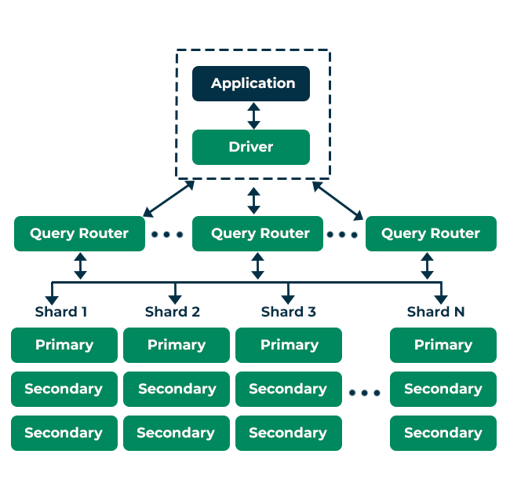

# NoSQL Guide


## What is NoSQL?
NoSQL, short for "Not Only SQL," refers to a variety of database systems that are designed to handle large volumes of data that don't necessarily fit into traditional relational databases. Unlike SQL databases NoSQL databases are more flexible and scalable, often making them ideal for big data applications and real-time web apps.

[NoSQL Explained By MongoDB](https://www.mongodb.com/resources/basics/databases/nosql-explained)
## Comparing SQL to NoSQL
### SQL Databases

**Structured Data**\
SQL databases use structured query language (SQL) to define and manipulate data. The data is stored in tables with predefined schemas.\
**ACID Compliance**\
Transactions in SQL databases are ACID-compliant (Atomicity, Consistency, Isolation, Durability), ensuring reliable and consistent transactions.\
**Vertical Scalability**\
Typically, SQL databases scale vertically by adding more power (CPU, RAM) to an existing server.

### NoSQL Databases
**Flexible Schema**\
NoSQL databases store data without a predefined schema, allowing for more flexibility. They can handle structured, semi-structured, and unstructured data.\
**Eventual Consistency**\
Many NoSQL databases are designed for eventual consistency, where the system will be consistent over time, not necessarily immediately.\
**Horizontal Scalability**\
NoSQL databases scale horizontally by adding more servers to the database.


### What Languages Can Be Used with NoSQL?
NoSQL databases can be accessed using various languages and interfaces, depending on the specific database. Here are some common ones:

- JavaScript (Node.js)
- Python
- Java
- C#
- Go
- Ruby
- PHP


Each NoSQL database might have its own specific language or query interface, like MongoDB uses BSON (Binary JSON) and its own query language.

## Example NoSQL Schema Design

In a NoSQL database, such as MongoDB, instead of defining tables and relationships, you store data in documents. Here’s a simple example for a blog application:

SQL Schema:
```
Table: Users
id, username, email
Table: Posts
id, user_id, title, content, created_at
```

NoSQL Schema (MongoDB):

```
{
  "user_id": "12345",
  "username": "johndoe",
  "email": "john@example.com",
  "posts": [
    {
      "post_id": "54321",
      "title": "My First Blog Post",
      "content": "This is my first ever blog post!",
      "created_at": "2024-05-21T12:00:00Z"
    }
  ]
}
```

## Concept and Benefits
### Scalability
**Horizontal Scaling**\
Adding more servers to distribute the load.


**Sharding**\
Distributing data across multiple machines to ensure that no single machine is overwhelmed.

### Benefits:
**High Availability**\
Redundant copies of data across multiple servers ensure that the database remains available even if one server fails.

**Performance**\
Can handle large volumes of read and write operations with low latency.

**Flexibility**\
Easily adapt to changing data requirements without needing to restructure
the entire database.

### Negatives

**Eventual Consistency**\
Unlike SQL databases, many NoSQL databases don't guarantee immediate consistency, which can be problematic for applications requiring real-time accuracy.

**Complexity**\
Managing a distributed system can be complex and may require specialized knowledge.

**Limited Capabilities for Complex Queries**\
While NoSQL databases excel at simple queries and fast access, they might not be as efficient for complex queries that involve multiple data relationships.

### Types of NoSQL Databases

**Document Stores**\
Examples: MongoDB, CouchDB\
Description: Store data as documents, typically in JSON or BSON format.

**Key-Value Stores**\
Examples: Redis, DynamoDB, Riak\
Description: Store data as a collection of key-value pairs. Ideal for caching and session management.

**Column-Family Stores**\
Examples: Cassandra, HBase\
Description: Store data in columns rather than rows. Suitable for handling large amounts of data across many servers.

**Graph Databases**\
Examples: Neo4j, ArangoDB\
Description: Store data in nodes, edges, and properties. Perfect for data with complex relationships like social networks.

**Time Series Databases**\
Examples: InfluxDB, TimescaleDB\
Description: Optimised for time-stamped or time-series data, such as log data or IoT sensor data.

**Object-Oriented Databases**\
Examples: db4o, ObjectDB\
Description: Store data in objects, similar to object-oriented programming languages.

# Case Studies

### Twitter
**Database Used**: Cassandra\
**Use Case**: Twitter uses Cassandra to store billions of tweets. Cassandra's ability to handle large volumes of data across multiple servers ensures high availability and fast read/write operations.

### Netflix
**Database Used**: DynamoDB, Cassandra\
**Use Case**: Netflix relies on NoSQL databases for its scalable architecture to handle streaming data, user data, and personalized recommendations. The distributed nature of NoSQL databases helps Netflix manage massive amounts of data efficiently.

### LinkedIn
**Database Used**: Voldemort (a key-value store)\
**Use Case**: LinkedIn uses Voldemort for various services that require high availability and speed, such as managing member profile data and activity feeds.

### eBay
**Database Used**: HBase\
**Use Case**: eBay utilises HBase to store and process vast amounts of transactional data. HBase's ability to scale horizontally allows eBay to handle heavy traffic and large datasets.

### Conclusion
NoSQL databases offer a powerful alternative to traditional SQL databases, providing flexibility, scalability, and high performance for handling large volumes of diverse data. While they come with their own set of challenges, their benefits make them suitable for many modern applications, from social media to e-commerce. Understanding the different types of NoSQL databases and their use cases can help you choose the right solution for your specific needs.

# MongoDB

## What is MongoDB
MongoDB is a type of database that stores information in a flexible way. Unlike traditional databases with strict rows and columns, MongoDB uses collections and documents.

[MongoDB Official Website](https://www.mongodb.com/)
### Collections
Think of these as the labeled boxes in our filing cabinet. Each collection holds a specific type of information, like "Customers," "Products," or "Orders."

### Documents 
These are the individual items inside each box. Each document holds information about a single thing within the collection. For a "Customers" collection, a document might have details about one customer, like their name, address, and purchase history.
Documents are written in a format called BSON (Binary JSON), which is a binary representation of JSON-like documents. Each document contains a set of key-value pairs, where the keys are strings and the values can be a variety of data types, including other documents, arrays, and more.


## MongoDB Architecture
### How Does It Work?
MongoDB's architecture is designed for high performance and scalability.
Unlike a filing cabinet you have to physically open, MongoDB uses a program called **mongod** to run in the background. This program manages all the data and makes it accessible to other applications through a special language, like a secret code to access the filing cabinet.


**Database**\
The top-level container for collections\
**Collection**\
A grouping of documents\
**Document**\
The individual data entries within a collection\
**Instance**\
The running instance of MongoDB which can host multiple databases.

## What are Replica Sets?
Imagine having multiple copies of your filing cabinet in different locations. Replica sets create copies of your data on other servers so if one server fails, another can take over seamlessly.


## What is Sharding?
As your collection grows, a single box (collection) might become overloaded. Sharding helps distribute the data across multiple servers, like having multiple filing cabinets to handle a massive document collection.

## Advantages of MongoDB
**Flexible Schema**\
You can store different types of data within the same collection.

**Scalability**\
Easy to scale horizontally using sharding.

**Performance**\
High performance for read and write operations.

**High Availability**\
Ensured through replica sets.

**Ease of Use**\
Simple to set up and use, especially for developers.


## Disadvantages of MongoDB
**Memory Usage**\
Can use a lot of memory since it keeps working sets in RAM.

**Complex Transactions**\
Handling complex transactions can be challenging compared to traditional relational databases.

**Joins**\
Lacks traditional join operations, making some queries more complex.

**Data Consistency**\
In some cases, ensuring strong data consistency can be complex.

## What Scenarios is MongoDB Good For?
Websites and applications that deal with large amounts of constantly changing data, like social media platforms or e-commerce stores.


Storing complex data with various structures, like product information with images, descriptions, and reviews.


## What Scenarios is MongoDB Not Good For?
Simple applications with well-defined data structures.

Situations where strict data organisation and complex queries are essential.

## Conclusion
MongoDB is a flexible and scalable NoSQL database ideal for handling diverse, large-scale data. It excels in real-time data processing and high availability but may not be suitable for complex transactions or strong consistency requirements. Understanding its strengths and limitations is key to effective use in modern applications.