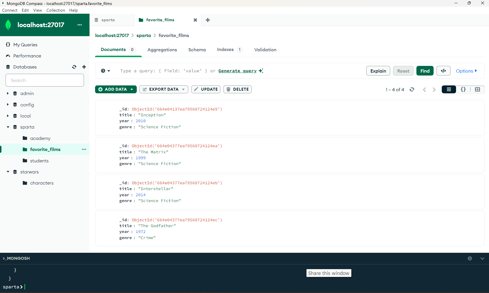
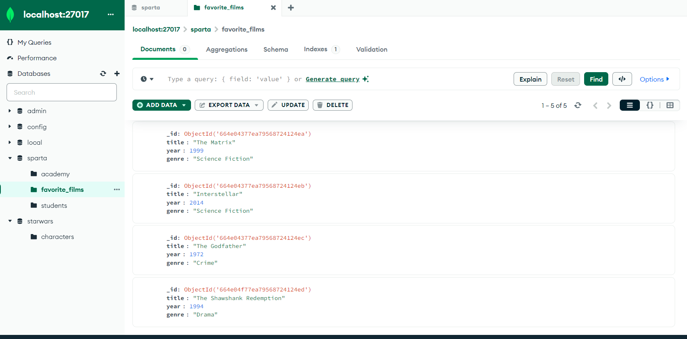
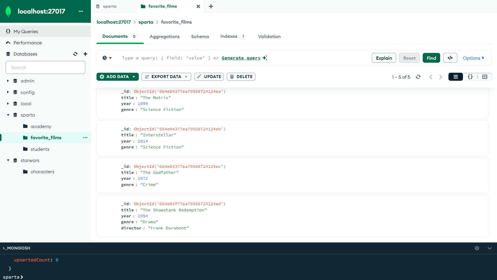
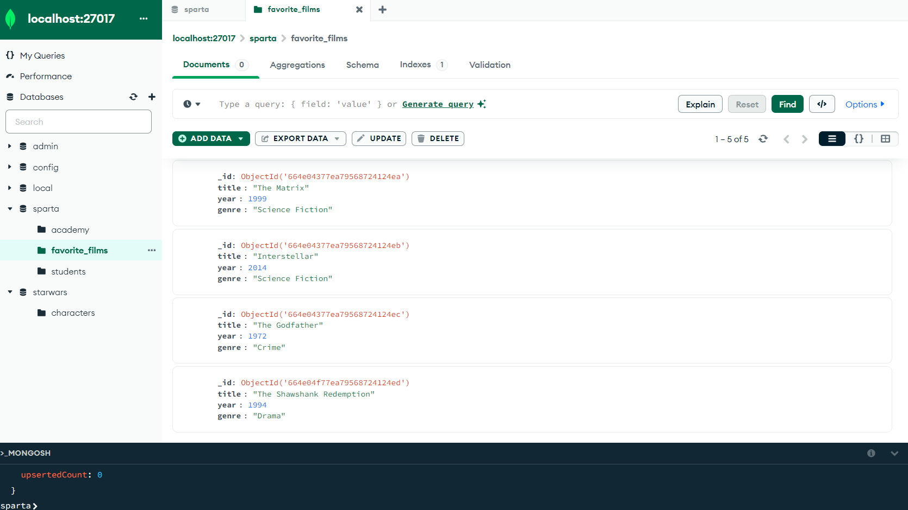
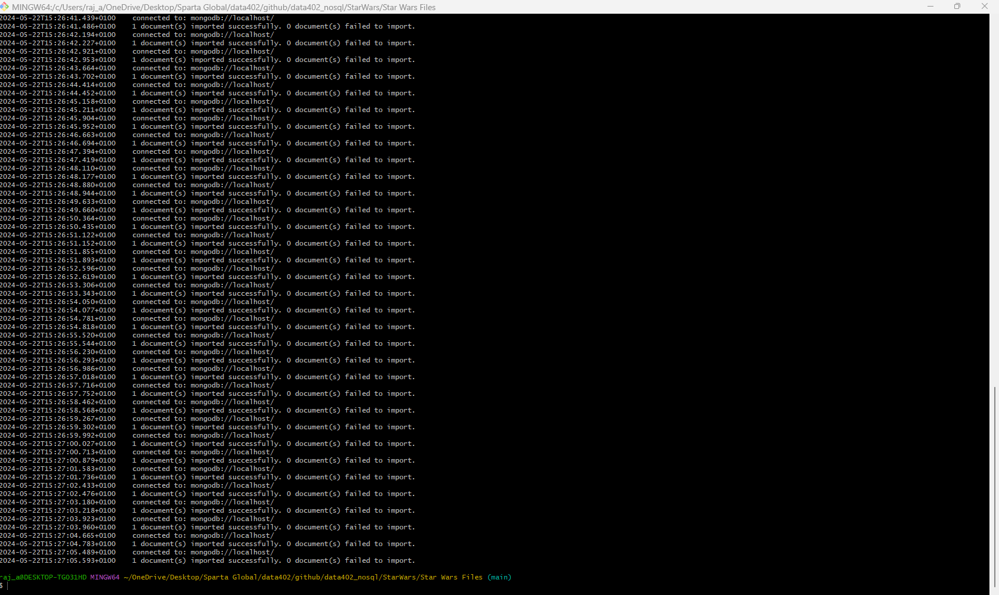

# MongoDB Exercises


1.


2.




3.
### **MongoDB Tools successfully installed**

4.
### Star Wars Zip successfully downloaded, extracted and command successfully ran

5.
```
switched to db starwars
db.characters.findOne({ name: "Luke Skywalker" });
```
```
db.characters.findOne({ name: "Chewbacca" }, { name: 1, eye_color: 1, _id: 0 });
{
  name: 'Chewbacca',
  eye_color: 'blue'
}
```
```
db.characters.findOne({ name: "Ackbar" }, { "species.name": 1, _id: 0 });
{
  species: {
    name: 'Mon Calamari'
  }
}
```

```
db.characters.find(
  { "species.name": "Human" },  // human species
  { name: 1, homeworld: 1, _id: 0 }  // nly the name and homeworld fields, exclude the _id field as included by default
);
```
7.
```
db.characters.find(
  { eye_color: { $in: ["yellow", "orange"] } }
);
```

8.
```
db.characters.find({
  eye_color: "blue",
  gender: "female"
});
```
```
db.characters.find({
  $or: [
    { eye_color: "blue" },
    { gender: "female" }
  ]
});
```

9.
```
db.characters.find({ height: { $gt: 200 } });
```
```
db.characters.updateMany(
  { height: "unknown" }, // Filter for documents where height is "unknown"
  [
    { 
      $set: { 
        height: null // set the "unknown" to null      } 
    }
  ]
);
```
```
db.characters.updateMany(
  { height: { $exists: true, $type: "string" } }, // filter for documents where height exists (and is not null) and is a string
  [
    { 
      $set: { 
        height: { 
          $toInt: "$height" 
        } 
      } 
    }
  ]
);
```
```
db.characters.find({ height: { $gt: 200 } });
```


10.

| $eq  | equal to                  |      
|------|---------------------------|
| $gt  | greater than              |      
| $gte | greather than or equal to |      
| $in  | in                        |      
| $lt  | less than                 |      
| $lte | less than or equal to     |      
| $ne  | not equal to              |       
| $nin | not in                    |      