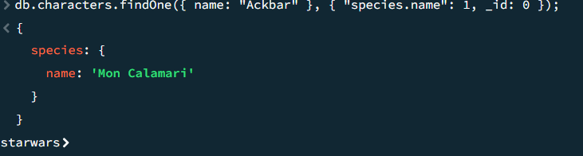

# MongoDB Exercises


1.
### Created collection for films, added documents
```commandline
{
  "$jsonSchema": {
    "bsonType": "object",
    "required": ["title", "year", "genre"],
    "properties": {
      "title": {
        "bsonType": "string",
        "description": "must be a string and is required"
      },
      "year": {
        "bsonType": "int",
        "minimum": 1900,
        "maximum": 2024,
        "description": "must be an integer between 1900 and 2024 and is required"
      },
      "genre": {
        "bsonType": "string",
        "description": "must be a string and is required"
      }
    }
  }
}

```


2.
### Add new document to collection

```commandline
db.favorite_films.insertOne({
  title: "Inception",
  year: 2010,
  genre: "Science Fiction"
});

```
### Add new field to document

```commandline
db.favorite_films.updateOne(
  { title: "The Shawshank Redemption" },
  { $set: { director: "Frank Darabont" } }
);

```
### Remove field from document

```commandline
db.favorite_films.updateOne(
  { title: "The Shawshank Redemption" },
  { $unset: { director: "" } }
);

```
### Remove document from collection

```commandline
db.favorite_films.deleteOne({ title: "The Shawshank Redemption" });

```
3.
### **MongoDB Tools successfully installed**

4.
### Star Wars Zip successfully downloaded, extracted and command successfully ran

5.
Query that finds the Luke Skywalker document
```
switched to db starwars
db.characters.findOne({ name: "Luke Skywalker" });
```

Return the value of name and eye_colour only, from the "chewbacca" document
```
db.characters.findOne({ name: "Chewbacca" }, { name: 1, eye_color: 1, _id: 0 });
{
  name: 'Chewbacca',
  eye_color: 'blue'
}
```
Check the species name of admiral ackbar, this is in an embedded document ("Species")

```
db.characters.findOne({ name: "Ackbar" }, { "species.name": 1, _id: 0 });
{
  species: {
    name: 'Mon Calamari'
  }
}
```


6. 
Query that gives us only the names + homeworld names of humans in the database
```
db.characters.find(
  { "species.name": "Human" },  // human species
  { name: 1, homeworld: 1, _id: 0 }  // nly the name and homeworld fields, exclude the _id field as included by default
);
```


7.
Query that gives us all the entries that have an eye_colour of either "yellow" or "orange"
```
db.characters.find(
  { eye_color: { $in: ["yellow", "orange"] } }
);
```

8.
Query that filter for characters that have both blue eyes and are female
```
db.characters.find({
  eye_color: "blue",
  gender: "female"
});
```


Query that filters for characters that have either blue eyes or are female
```
db.characters.find({
  $or: [
    { eye_color: "blue" },
    { gender: "female" }
  ]
});
```

9.
Write a query that finds characters with a height over 200cm

```
db.characters.find({ height: { $gt: 200 } });
```
Note: Height has been recorded as a string and there are some missing a height value entirely. Can you find out how to convert all the height strings to ints?
```
db.characters.updateMany(
  { height: "unknown" }, // Filter for documents where height is "unknown"
  [
    { 
      $set: { 
        height: null // set the "unknown" to null      } 
    }
  ]
);
```
```
db.characters.updateMany(
  { height: { $exists: true, $type: "string" } }, // filter for documents where height exists (and is not null) and is a string
  [
    { 
      $set: { 
        height: { 
          $toInt: "$height" 
        } 
      } 
    }
  ]
);
```
```
db.characters.find({ height: { $gt: 200 } });
```
Run your initial height query again to confirm your solution works.


10.

| Operator | Meaning                   |      
|----------|---------------------------|
| $eq      | equal to                  | 
| $gt      | greater than              |      
| $gte     | greather than or equal to |      
| $in      | in                        |      
| $lt      | less than                 |      
| $lte     | less than or equal to     |      
| $ne      | not equal to              |       
| $nin     | not in                    |


# Basic Exercises

Exercise 1 - Find the height of Darth Vader, only return results for the name and the height.

Exercise 2 - Find all characters with yellow eyes, only return results for the names of the characters.

Exercise 3 - Find male characters. Limit your results to only show the first 3.

Exercise 4 -Find the names of all the humans whose homeworld is Alderaan.
```commandline
NO RESULTS
```
# Advanced Exercises

## Exercise 1. 
### What is aggregation and how does it work?
Aggregation is a way of processing a large number of documents in a collection by passing them through different stages. Each stage transforms the documents and passes the results to the next stage. The final output is a result of all these transformations.

Here's how it works in a nutshell:

**Pipeline Stages**\
Aggregation works in stages, like a recipe. Each stage performs a specific task on the documents, such as filtering (picking only Jedi characters), grouping (putting them all in a group), or calculating something (counting the total number of Jedi).

**Input and Output**\
The documents flow through these stages, and the output of one stage becomes the input for the next. It's like passing ingredients through different steps in a recipe.

**Common Stages**\
Some common stages you'd use in your Star Wars adventure include:

**$match**\
This stage is like a sieve, filtering documents based on certain criteria. For example, you could filter for characters with lightsabers.

**$group**\
This stage is like sorting characters into groups based on a field, like the lightsaber color (blue or red). You can also perform calculations within each group, like counting the number of characters in each color group.

**$sum**\
This stage is like adding things up. You could use it to find the total number of Jedi in your collection.

**The Result**\
Finally, after all the stages are complete, you get the final output, which is a new set of documents containing the grouped and calculated information.
e.g.
```commandline
db.characters.aggregate([
  {
    $match: { "species.name": "Human" } // Step 1: Filter for human characters
  },
  {
    $addFields: { // Step 2: Convert height to integer
      height: { $toInt: "$height" }
    }
  },
  {
    $group: { // Step 3: Group by species and calculate average height
      _id: "$species.name",
      averageHeight: { $avg: "$height" }
    }
  }
]);

```

### Write a query that finds the total (sum) of the height of all human characters in the db
```commandline
use starwars
switched to db starwars
db.characters.aggregate([
  {
    $match: { "species.name": "Human" } // Step 1: filter for humans
  },
  {
    $addFields: { // Step 2: convert height to int
      height: { $toInt: "$height" }
    }
  },
  {
    $group: { // Step 3: group by species and calculate total height
      _id: null, // Group all human characters together
      totalHeight: { $sum: "$height" }
    }
  }
]);
```
```
{
  _id: null,
  totalHeight: 5476
}
```
### Write a query that finds the max height per homeworld
```commandline
db.characters.aggregate([
  {
    $addFields: { // Step 1: convert height to int
      height: { 
        $cond: { if: { $ne: ["$height", "unknown"] }, then: { $toInt: "$height" }, else: null }
      }
    }
  },
  {
    $group: { // Step 2: group by homeworld and find max height
      _id: "$homeworld.name", // group by homeworld name
      maxHeight: { $max: "$height" } // find max height in each group
    }
  }
]);
```

### Write a query that finds the mass and count per species. Filter out null values and sort by average mass (ascending order)
```commandline
db.characters.aggregate([
  // 1. Filter out documents with null or "unknown" mass
  {
    $match: {
      mass: { $ne: "unknown" },
      mass: { $ne: null }
    }
  },
  // 2. Convert mass from string to integer
  {
    $addFields: {
      mass: { $toInt: "$mass" }
    }
  },
  // 3. Group by species name and calculate average mass and count
  {
    $group: {
      _id: "$species.name",
      averageMass: { $avg: "$mass" },
      count: { $sum: 1 }
    }
  },
  // 4. Sort by average mass in ascending order
  {
    $sort: {
      averageMass: 1
    }
  }
]);

```
## Exercise 2. 
### Some aggregation doesn't require the .aggregate() method

### Use .distinct() to find a list of all species names in the database
```commandline
const speciesNames = db.characters.distinct("species.name");
```
### Use .count() or .countDocuments() to get a count of the amount of humans in the database
```commandline
const humanCount = db.characters.count({ "species.name": "Human" });
printjson(humanCount);
```
### What does .estimatedDocumentCount({}) do?
It returns an estimate of the number of documents in a collection.
based on metadata statistics rather than scanning all documents. It's faster than the .count() or .countDocuments() methods, especially for large collections, because it doesn't need to examine every document.
As it relies on metadata statistics, the count it returns may not always be exact. It provides a fast but potentially imprecise estimate. 

## Exercise 3. 

The starwars database uses embedded documents for things like spicies and homeworld. Another option would be to use references.

Find the ObjectID for Darth Vader in the collection. Copy the output to your clipboard.

```commandline
db.characters.findOne({ name: "Darth Vader" }, { _id: 1 });
```
```commandline
{
  _id: ObjectId('664e00882fb0d7b81000f2ff')
}
```

```commandline
db.starships.aggregate([
  { $lookup: {
    from: "characters",
    localField: "pilot",
    foreignField: "_id",
    as: "matched_pilot"
  } },
  { $project: {name: 1, model: 1, "matched_pilot.name": 1}}
])
```
Now, add the Millenium Falcon to the starships collection. Look up the data or make it up. The pilot must take an array with multiple ObjectIDs though.

We could then use the same lookup as before - it works with ObjectIds in arrays too. But we'll get a huge amount of information back. To restrict it to certain fields, we could add a $project step to the pipeline, which projects certain data to the next step:
```commandline
{
  _id: ObjectId('664f1e02acec08c217c3d3ff'),
  name: 'TIE Advanced x1',
  model: 'Twin Ion Engine Advanced x1',
  matched_pilot: []
}

{
  _id: ObjectId('664f1e4facec08c217c3d400'),
  name: 'Millennium Falcon',
  model: 'YT-1300 light freighter',
  matched_pilot: []
}
```
# PYMONGO AGGREGATION

Exercise 1 - What is the average height of female characters?
```commandline
db.characters.aggregate([
  // match docs where gender is female
  { $match: { gender: "female" } },
  
  // group docs and calculate average height
  { 
    $group: {
      _id: null,
      average_height: { $avg: "$height" }
    } 
  }
]);
```
```
{
  _id: null,
  average_height: 165.47058823529412
}
```
Exercise 2 - Which character is the tallest?
```commandline
db.characters.find().sort({ "height": -1 }).limit(1)

```
