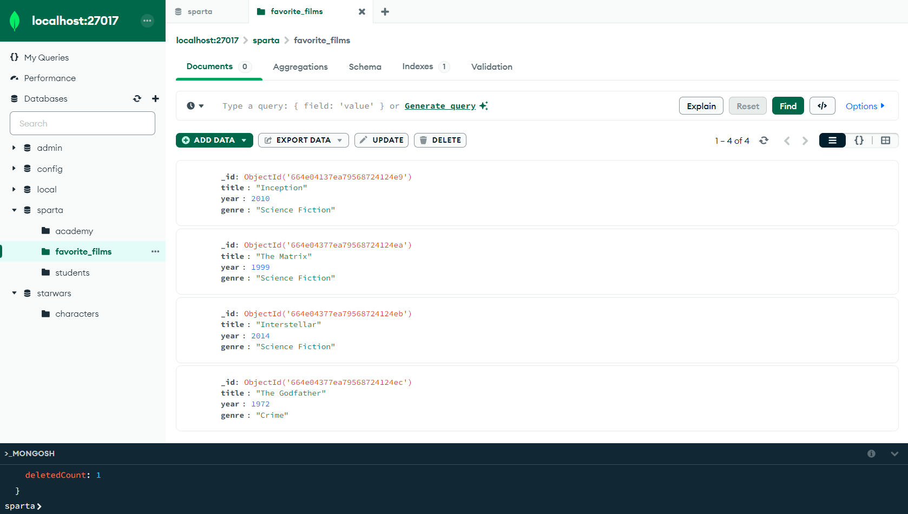

# MongoDB Exercises


1.
### Created collection for films, added documents


2.
### Add new document to collection

### Add new field to document

### Remove field from document

### Remove document from collection

3.
### **MongoDB Tools successfully installed**

4.
### Star Wars Zip successfully downloaded, extracted and command successfully ran

5.
Query that finds the Luke Skywalker document
```
switched to db starwars
db.characters.findOne({ name: "Luke Skywalker" });
```

Return the value of name and eye_colour only, from the "chewbacca" document
```
db.characters.findOne({ name: "Chewbacca" }, { name: 1, eye_color: 1, _id: 0 });
{
  name: 'Chewbacca',
  eye_color: 'blue'
}
```
check the species name of admiral ackbar, this is in an embedded document ("Species")

```
db.characters.findOne({ name: "Ackbar" }, { "species.name": 1, _id: 0 });
{
  species: {
    name: 'Mon Calamari'
  }
}
```


6. 
Query that gives us only the names + homeworld names of humans in the database
```
db.characters.find(
  { "species.name": "Human" },  // human species
  { name: 1, homeworld: 1, _id: 0 }  // nly the name and homeworld fields, exclude the _id field as included by default
);
```


7.
query that gives us all the entries that have an eye_colour of either "yellow" or "orange"
```
db.characters.find(
  { eye_color: { $in: ["yellow", "orange"] } }
);
```

8.
query that filter for characters that have both blue eyes and are female
```
db.characters.find({
  eye_color: "blue",
  gender: "female"
});
```


Query that filters for characters that have either blue eyes or are female
```
db.characters.find({
  $or: [
    { eye_color: "blue" },
    { gender: "female" }
  ]
});
```

9.
Write a query that finds characters with a height over 200cm

```
db.characters.find({ height: { $gt: 200 } });
```
Note: Height has been recorded as a string and there are some missing a height value entirely. Can you find out how to convert all the height strings to ints?
```
db.characters.updateMany(
  { height: "unknown" }, // Filter for documents where height is "unknown"
  [
    { 
      $set: { 
        height: null // set the "unknown" to null      } 
    }
  ]
);
```
```
db.characters.updateMany(
  { height: { $exists: true, $type: "string" } }, // filter for documents where height exists (and is not null) and is a string
  [
    { 
      $set: { 
        height: { 
          $toInt: "$height" 
        } 
      } 
    }
  ]
);
```
```
db.characters.find({ height: { $gt: 200 } });
```
Run your initial height query again to confirm your solution works.


10.

| Operator | Meaning                   |      
|----------|---------------------------|
| $eq      | equal to                  | 
| $gt      | greater than              |      
| $gte     | greather than or equal to |      
| $in      | in                        |      
| $lt      | less than                 |      
| $lte     | less than or equal to     |      
| $ne      | not equal to              |       
| $nin     | not in                    |      